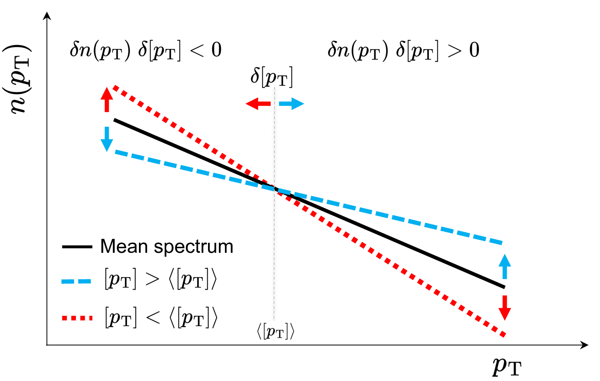
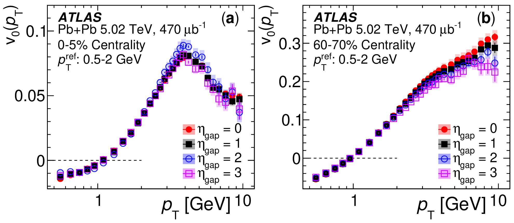
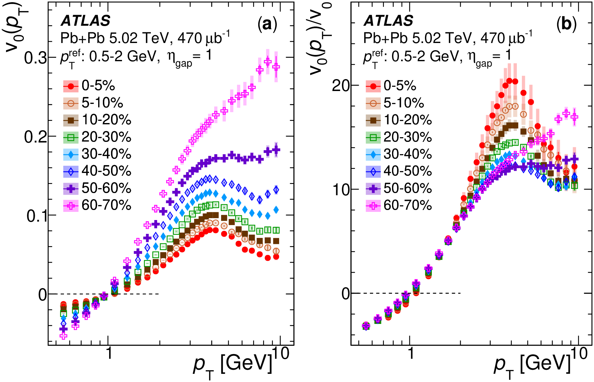
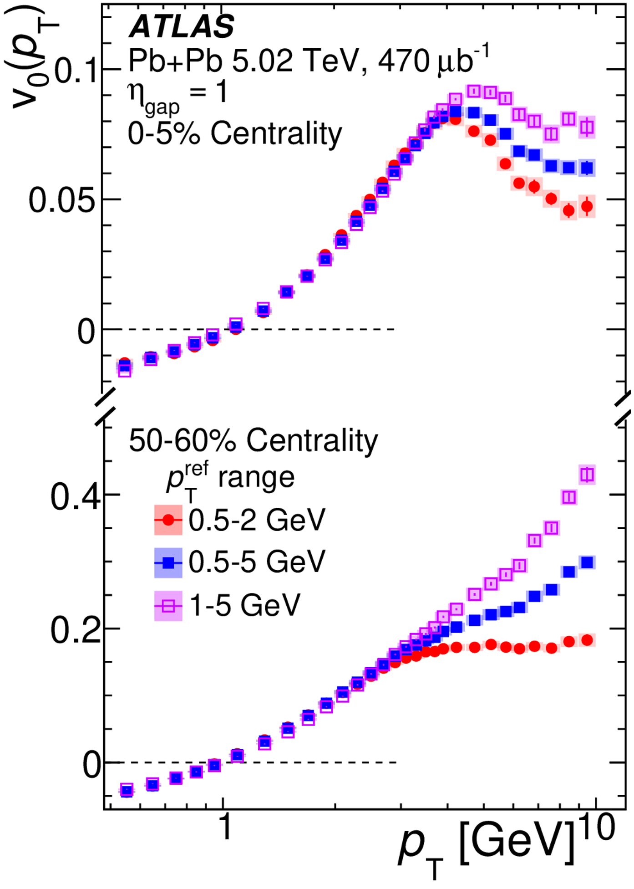
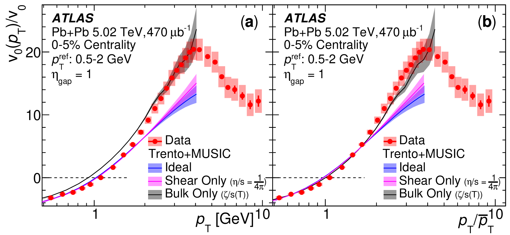

::: {.project-meta}
**ATLAS Collaboration**  
*Physical Review Letters* **136**, 032301 (2026)
:::

::: {.project-links}
[PRL][prl]{.btn .btn-primary}
[arXiv][arxiv]{.btn .btn-outline-primary}
[SQM 2026 Talk](talks/sqm-2026.qmd){.btn .btn-outline-primary}
[Presentation Slides][sqm-slides]{.btn .btn-outline-primary}
:::

::: {.project-award}
**Andre Mischke Award — Best Experimental Talk**
[<i class="bi bi-link-45deg"></i>](talks/sqm-2026.qmd#recognition){.award-link title="Read about the award"}  
Strangeness in Quark Matter 2026, Los Angeles
:::

## Overview

Radial flow is one of the fundamental manifestations of the collective expansion of the
quark–gluon plasma (QGP). While anisotropic flow has been extensively established as a
collective phenomenon and developed into a precision probe of QGP properties, comparable
direct experimental evidence for the global collective nature of radial flow had been
missing. This work introduces the first measurement of the transverse-momentum dependence of
radial-flow fluctuations, $v_0(p_T)$, over $0.5 < p_T < 10$ GeV in Pb+Pb collisions at
$\sqrt{s_{\mathrm{NN}}}=5.02$ TeV with the ATLAS detector. The measurement tests radial flow
against three characteristic hallmarks of collectivity: **long-range correlations in
pseudorapidity, factorization in $p_T$, and a centrality-independent response shape**. All
three are observed in the flow-dominated regime, providing direct experimental evidence for
the global collective nature of radial flow. Beyond establishing collectivity, comparisons
with hydrodynamic calculations demonstrate that $v_0(p_T)$ is sensitive to the bulk
viscosity of the QGP. The measurement therefore establishes differential radial flow as a
new tool for studying both the collective dynamics and transport properties of the strongly
interacting QGP medium.

## Analysis

### Why establish radial-flow collectivity?

The collective expansion of the quark–gluon plasma can manifest itself through two
complementary forms of flow. **Anisotropic flow** reflects the hydrodynamic response to the
initial spatial shape of the collision, while **radial flow** reflects the response to
fluctuations in the transverse size and density of the system.

For anisotropic flow, its collective origin has been established experimentally through a
broad set of characteristic signatures, including long-range correlations, factorization,
and a universal hydrodynamic response. Radial flow, despite being of comparable fundamental
importance, had not been subjected to the same direct experimental tests.

This distinction matters because radial-flow observables are increasingly being used to
constrain properties of the QGP. Event-by-event fluctuations of the mean transverse
momentum, $[p_T]$, exhibit striking behavior in ultra-central Pb+Pb collisions, including a
sharp suppression of their variance and a rapid increase of $\langle[p_T]\rangle$ with
multiplicity. These features have been interpreted within a hydrodynamic picture in which
radial-flow fluctuations originate from both global collision geometry and local density
fluctuations.

Before such observables can be used as precision probes of the QGP equation of state or
transport properties, however, an important logical step must be established experimentally:
**is radial flow itself genuinely collective?**

### Differential radial flow

To answer this question, the analysis introduces the differential radial-flow observable
$v_0(p_T)$.

Its physical origin can be understood by considering events with approximately fixed total
entropy. An event with a smaller transverse collision area develops stronger pressure
gradients and therefore experiences a larger radial push. Its particle spectrum becomes
flatter and its event-by-event mean transverse momentum $[p_T]$ increases. Conversely, an
event with a larger transverse area experiences weaker radial expansion and develops a
steeper spectrum.

This produces a characteristic correlation between fluctuations of the local particle yield
and fluctuations of $[p_T]$. At low $p_T$, the two quantities are anticorrelated; near the
ensemble mean transverse momentum the correlation crosses zero; and at higher $p_T$ it
becomes positive.

The differential observable is constructed from this correlation,

$$
v_0(p_T)
=
\frac{1}{v_0}
\frac{
\langle \delta n(p_T)\delta[p_T]\rangle
}{
\langle n(p_T)\rangle\langle[p_T]\rangle
},
$$

where $n(p_T)$ is the normalized particle spectrum and $v_0$ is the corresponding integrated
radial-flow fluctuation.

::: {#fig-v0-cartoon}
{width=90%}

Schematic illustration of the physical origin of differential radial flow. Events with
larger $[p_T]$ have flatter spectra, while events with smaller $[p_T]$ have steeper spectra,
producing a characteristic sign change in the correlation between $\delta n(p_T)$ and
$\delta[p_T]$.
:::

A two-subevent method is used in which the local spectrum and $[p_T]$ are measured using
particles separated in pseudorapidity. This suppresses short-range correlations and allows
the global component of the radial-flow signal to be isolated.

### Experimental hallmarks of collectivity

The key idea of the measurement is to test radial flow against the same experimental
criteria that are traditionally used to establish anisotropic collectivity.

#### Long-range correlations

A global collective expansion should generate correlations extending over large separations
in pseudorapidity. Experimentally, $v_0(p_T)$ is found to be largely insensitive to the
pseudorapidity gap used between the two subevents, as shown in @fig-long-range.

::: {#fig-long-range}
{width=85%}

Differential radial flow $v_0(p_T)$ measured for different pseudorapidity gaps in central
and peripheral Pb+Pb collisions. The weak dependence on the gap size demonstrates the
long-range nature of the radial-flow correlation.
:::

This behavior is observed in both central and peripheral Pb+Pb collisions. Deviations
appear primarily at larger $p_T$, where contributions from jets and other non-flow effects
become increasingly important.

#### Centrality-independent response

The absolute magnitude of $v_0(p_T)$ varies strongly with collision centrality. Much of this
variation reflects changes in the magnitude of the initial-state size fluctuations rather
than changes in the subsequent hydrodynamic response.

To reduce this dependence, the differential measurement is divided by its integrated
counterpart, $v_0$. As shown in @fig-centrality-response, the resulting quantity,
$v_0(p_T)/v_0$, exhibits a striking behavior: curves from widely separated centrality
intervals collapse onto an approximately common shape in the flow-dominated region.

::: {#fig-centrality-response}
{width=95%}

Differential radial flow $v_0(p_T)$ for different centrality intervals before and after
normalization by the integrated radial-flow fluctuation $v_0$. The strong centrality
dependence of the absolute magnitude is substantially reduced after normalization, revealing
an approximately universal response shape in the flow-dominated region.
:::

This centrality-independent shape indicates that very different initial collision geometries
are being transformed into momentum space through a common underlying hydrodynamic response.

#### Factorization

A collective mode generated by a global hydrodynamic expansion is also expected to satisfy
factorization. This is tested by changing the reference $p_T$ interval used to define
$[p_T]$ and its event-by-event fluctuations. For $p_T \lesssim 3$ GeV, the measured
$v_0(p_T)$ is essentially insensitive to this choice, demonstrating factorization in the
region dominated by soft collective physics, as shown in @fig-factorization.

::: {#fig-factorization}
{width=50%}

Differential radial flow $v_0(p_T)$ measured using different reference $p_T$ ranges in
central and peripheral Pb+Pb collisions. The agreement of the measurements at low $p_T$
demonstrates factorization in the flow-dominated regime.
:::

At larger transverse momentum, the factorization begins to break. In peripheral collisions,
this behavior is consistent with increasing contamination from residual non-flow
correlations, while in central collisions the high-$p_T$ response becomes sensitive to
jet-quenching phenomena.

### Connection to QGP transport properties

Once the collective nature of radial flow is established, the differential observable can be
used to investigate properties of the medium itself.

The measured $v_0(p_T)/v_0$ is compared with hydrodynamic calculations based on the
Trento+MUSIC framework. The ideal-hydrodynamic calculation and the calculation including
shear viscosity give very similar predictions and underestimate the data at high $p_T$,
failing to reproduce the measured shape. In contrast, the inclusion of a temperature-dependent
bulk viscosity, $\zeta/s(T)$, substantially modifies the high-$p_T$ behavior and provides a
much better description of the data. After additionally accounting for the difference in the
mean transverse momentum between model and data by scaling the horizontal axis with
$\bar{p}_T$, the agreement improves further, as shown in @fig-bulk-viscosity.

::: {#fig-bulk-viscosity}
{width=90%}

Comparison of the measured scaled differential radial flow with Trento+MUSIC hydrodynamic
calculations. The ideal and shear-only calculations underestimate the data at high $p_T$,
while including a temperature-dependent bulk viscosity significantly improves the
description. Scaling the horizontal axis by the mean transverse momentum further improves
the agreement.
:::

The normalization by the integrated $v_0$ suppresses much of the influence of the initial-state
fluctuation magnitude and emphasizes the hydrodynamic response. The improved description of
the measured shape after including bulk viscosity demonstrates the sensitivity of differential
radial flow to $\zeta/s$, establishing $v_0(p_T)$ as a new experimental probe of QGP transport
properties.

### Broader implications

By exhibiting long-range correlations, a centrality-independent response shape, and
factorization, radial flow satisfies the same key hallmarks of collectivity established for
azimuthal flow. These results elevate radial flow to the rigorous standing of azimuthal
flow, establishing it as a powerful new probe for constraining QGP transport properties.

The same observable also opens a path toward future system-size studies. Measurements of
$v_0(p_T)$ in systems such as p+O, O+O, Ne+Ne, and other small (p+p) or exotic collision
systems ($\gamma$+Pb) could provide an independent probe of collectivity, help explore how
the emergence of QGP-like behavior evolves with system size, and ultimately help identify
the smallest collision systems capable of forming a QGP droplet.

## Additional Resources

**Official ATLAS Coverage**

The ATLAS Collaboration featured this measurement in its public coverage of
Quark Matter 2025, with an accessible discussion of the radial-flow result and
its implications for collectivity and QGP transport properties.

[ATLAS Highlight][atlas-highlight]{.btn .btn-outline-primary}

**SQM 2026 Proceedings**

A proceedings contribution based on the SQM 2026 presentation is currently in
preparation. The publication will be added here once available.

[prl]: https://journals.aps.org/prl/abstract/10.1103/ldcn-r2lq
[arxiv]: https://arxiv.org/abs/2503.24125
[sqm-talk]: https://indico.global/event/13943/contributions/143376/
[sqm-slides]: https://indico.global/event/13943/contributions/143376/attachments/68267/132321/Presentation_SQM_FinV0pT_V3.pdf
[atlas-highlight]: https://atlas.cern/Updates/News/Highlights-Quark-Matter-2025
[cds]: https://cds.cern.ch/record/2929038
